Over the past couple weeks I have had the great opportunity to developer off of Facebook's Messenger Platform (Link) and leverage Microsoft's LUIS Engine (link). What are those and what can you do with them? Well those are two tools which separately may not be able to accomplish much but combined can accomplish a vast amount. So let's get started:

## Facebook Messenger

Launched in April, Facebook released a way for developers to use Facebook's Messenger platform to create apps for it. What kind of apps you may ask? Well, if there is any interaction with the user and the business, there can be an app on Facebook Messenger for it. The key to this is that it allows users to interact with apps and companies within an app they are already using, Facebook Messenger. During their conference, Facebook showcased two apps - CNN and Poncho. CNN obviously does the news and Poncho is a smart weather assistant. Both apps worked really well but were based off of two different ideas. CNN isn't much about the user talking or interacting, usually just clicking buttons or getting the news while Poncho is about interacting with the AI to retrieve the weather.

## Microsoft LUIS

LUIS (Language Understanding Intelligent Service) is a Microsoft product currently in Preview (Beta) that uses natual language processing to understand certain phrases. Officially a part of [Microsoft Cognitive Services](https://www.microsoft.com/cognitive-services/), LUIS allows developers to create interactions using natural language and then develop off of that. Using APIs or current SDKs, Microsoft is working on building a suite of tools to help developers create seemless interactions. Using LUIS, you can also leverage Cortana, Microsoft's AI, to help understand phrases and intents of users. From there you create models which help define paths and stories that a user may take.

## Combining Facebook and Microsoft

Okay, enough with the words. Let's get into the development! Please do note, both of these services are in Beta.

### Setup & Administration

First off, let's make some assumptions.

1. You know basic termial/command line usage.
2. We will be using `git` and **Github** a fair amount. (So thus a Gitub account is required)
3. NodeJS and NPM installed on your system. There are a plethora of tutorials out there to help you out with this, I am unable to help you out here right now.
4. A Facebook account is required, more is required later but we can get to that later
5. A Microsoft account is also required. This can be an Outlook email (like actually an @outlook.com email) or a Hotmail email

### Setuping Up Facebook

Note, Facebook does have their own instructions, to follow their instructions you can click on "Messenger Platform" --> "Start Building" --> "Getting Started" (in the left sidebar). Otherwise, let's continue on.

#### Creating a Facebook Page

1. Create a Facebook Page at [https://www.facebook.com/pages/create](https://www.facebook.com/pages/create). Feel free to create whatever you like, you do not need to make it public or publish yet! For this tutorial we are going to make a basic Weather Page.
2. I decided that the WeatherBot is a Brand or Product and named it "WeatherBot" 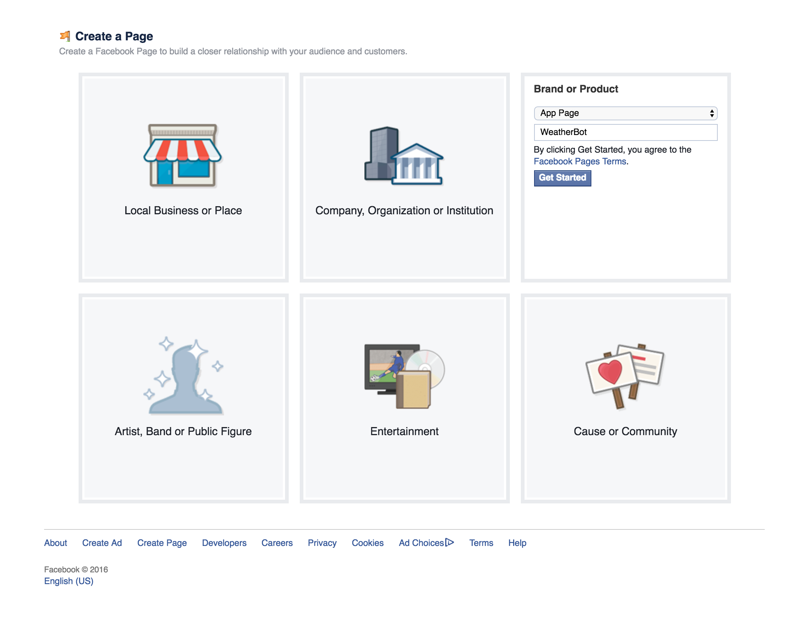
3. Clicking **Get Started** asks me to set up more information about this page, so let's fill a couple things out:

- About: 'This is a simple demonstration of finding the weather!' 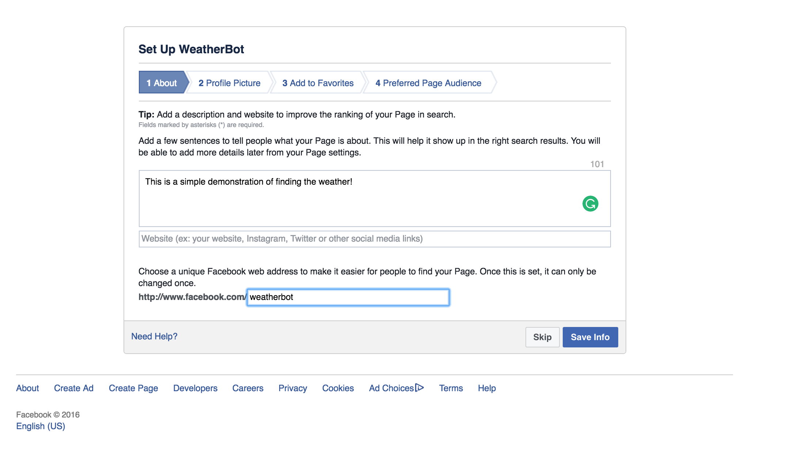
- Profile Picture: I just found a random one that I decided to put up, nothing important. 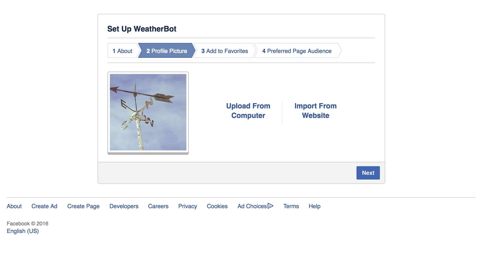
- Add to Favorites: I skipped this
- Preferred Page Audience: I skipped this also

4. Our page is successfully created! Take a look at it below: 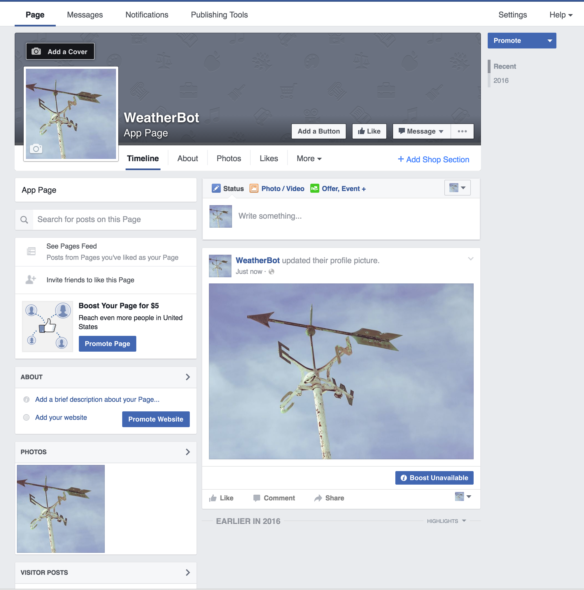
5. Let's head over to the "Settings" in the upper right, and under General -> Page Visibility, I unpublished my page. It isn't important right now and doesn't need to be published to test. Hit save and we should be good! 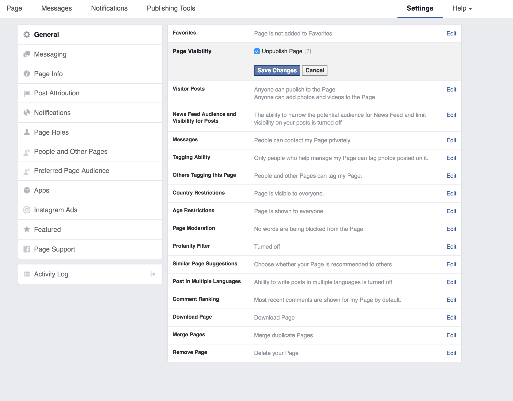

#### Creating a Facebook APP

1. Head over to the [Facebook Developer's site](https://developers.facebook.com/quickstarts/?platform=web) to get started.
2. Unless you have an existing app, in the top right click on "Skip and Create App ID". Put in the necessary information for your bot/app (don't forget your email) 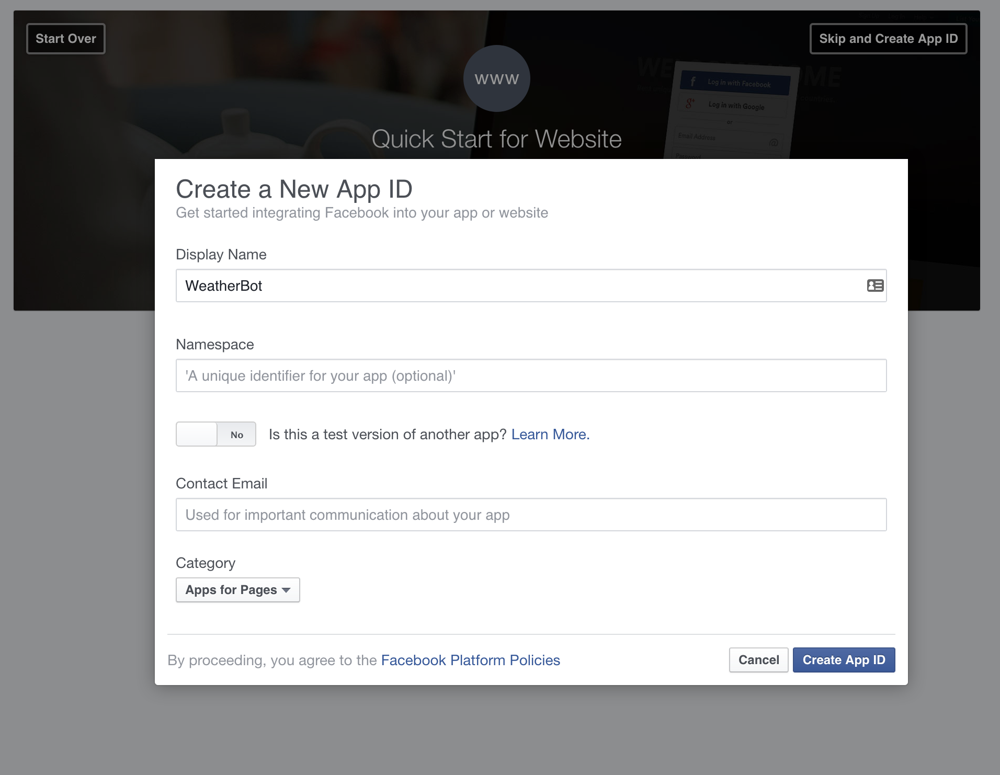
3. Our app is officially set up - you should see a dashboard like this: 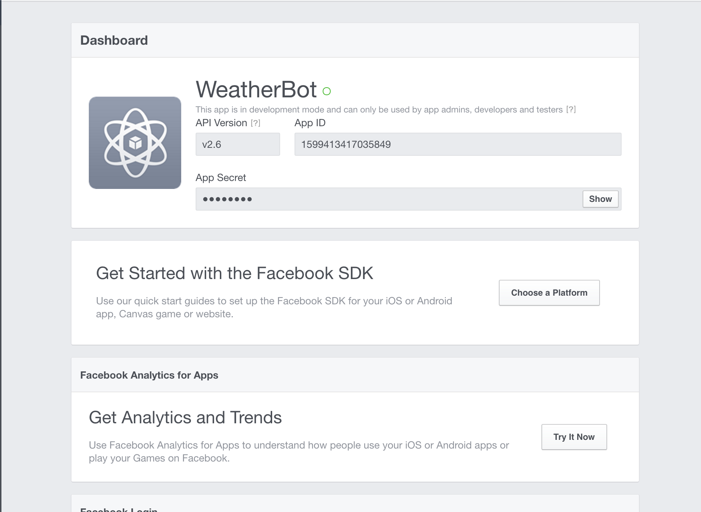

Next up, we need to get some code up and running so we can connect Facebook!

### Downloading Botkit

You may be asking yourself now, "Hey wait, Microsoft has their own Bot Framework (BotBuilder), why aren't we using that?" Well that is a valid question, a great question actually and I'll share my thoughts. [Microsoft's Bot Builder SDK](https://github.com/Microsoft/BotBuilder), like it's LUIS NLP, is still being developed and in beta mode. I originally had the same thought as you and actually developed first on the BotBuilder framework. I attemped to use C# to build on it, but I don't know it/my Windows VM on Mac wasn't the greatest so I stopped, and then I tried using the NodeJS SDK. The BotBuilder offers some great features such as one-click integrations with multiple apps (Telegram, Facebook, Skype, etc.) and some conversational flows integrated into the code (called Dialogs). However, it is still growing, being developed, and learning what it needs to be able to do. Some features I was unable to figure out (such as Facebook's Postbacks), and deployment was a real pain in the arse. I would be testing on Facebook and it would just not respond...which is unfortunate for a guy who likes to make small changes then test them. I don't doubt that it'll be a great tool in the near future, but for now, I steered away from using it after a couple days.

I decided to chose a different framework called [BotKit](https://github.com/howdyai/botkit) which has been developed for a bit longer and has some great documentation. It also has an npm module/package for easy integration.

Okay, less words, I know I know. Let's get back to the steps.

1. Open up your terminal and navigate to where you want your development folder to live. I have a folder in my Documents folder called Development where I store all my development. Feel free to do whatever you prefer.
2. `mkdir weatherbot && cd weatherbot` - weatherbot is the name of the folder you want your bot to live in/the name of your app, call it whatever you like
3. You should be inside the folder (that's what `cd weatherbot` did), you can now run `npm init` and follow the prompts. I usually type in the name and description, then hit Enter for everything else 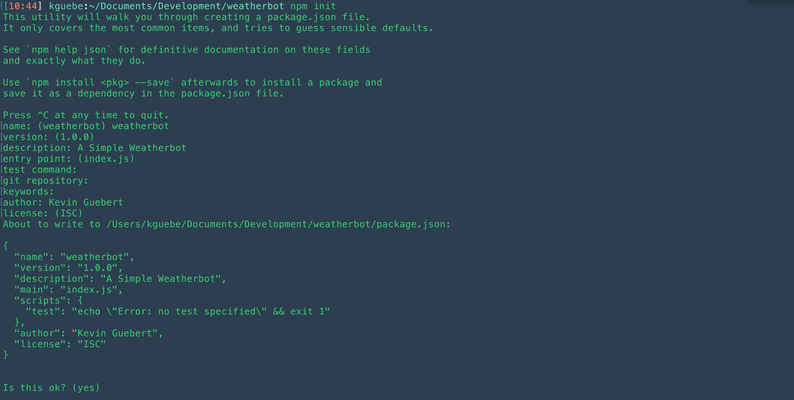
4. Okay awesome, if you type `ls` you should see a `package.json` file in your folder and that's it. 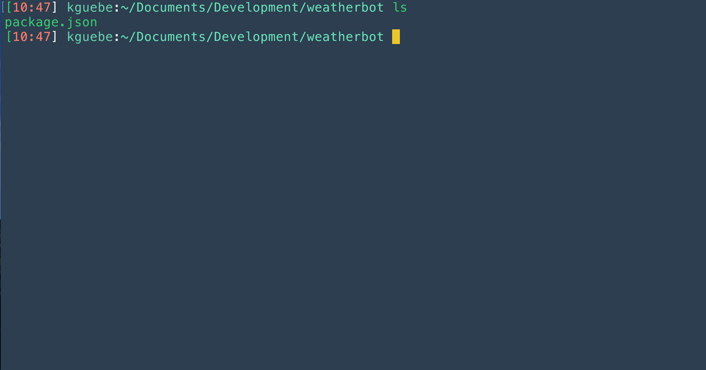
5. Now it is time to install all the packages we are going to be using for this project, I'll list them below and then the commands to install them

- BodyParser
- BotKit
- Delay
- Geocoder
- Moment
- OS
- JFS
- Request
- Underscore

6. Install them all quickly (and save them) with `npm install --save body-parser botkit delay geocoder jfs moment os request underscore`
7. Hopefully they all installed successfully, if not, feel free to ask questions below.
8. If you recall in your `npm init` prompts, one of them asked for "Entry Point" - this will be the file to create and work in. I just used the default `index.js` but if you chose another, like `app.js` is fairly commen, you need to create that.
9. Create the file you need either in your favorite IDE or with a simple `touch index.js`
10. This is where I open up Sublime Text 3, but if you have your favorite IDE open already, or have a different one, just have it open
11. Go ahead and open your `index.js` file and right now you should see nothing in the file because we just created. To start off we need to make sure we include all the packages we installed a couple steps ago. So let's do that:

    var request   = require('request');
    var Botkit    = require('botkit');
    var os        = require('os');
    var _         = require('underscore');
    

#### Setting up Botkit

1. With your packages included, it is now (finally) time to get into using Botkit and setting everything up.
2. However, before we get there we need 3 important variables from Facebook. So let's head back to the browser and go to the Facebook page you created.
3. Click on "About" (look to the right of the profile picture) and scroll all the way down to the bottom until you find "Facebook Page ID" 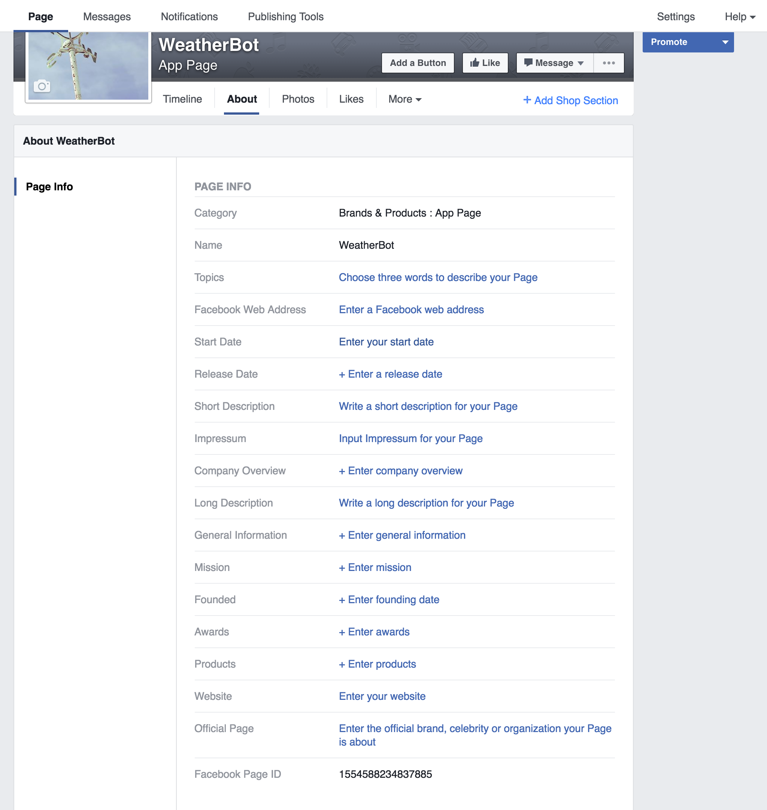
4. Save that ID for later use/write it down/remember it/keep the browser open
5. Open up a new tab and go to your Facebook App you created at the [Developers Center for Facebook](https://developers.facebook.com) - if it doesn't automatically populate, go to the top right corner where it says "My Apps" and click on the one you created
6. On the left hand side, click on "+Add Product" and then chose "Get Started" for "Messenger"
7. Click Getting Started on the next screen 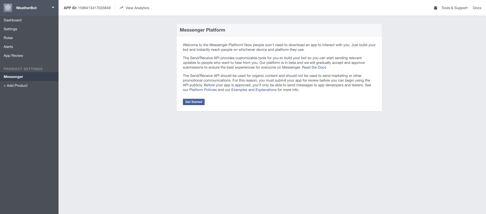
8. Now you should see a screen that has "Token Generation" in the top middle section 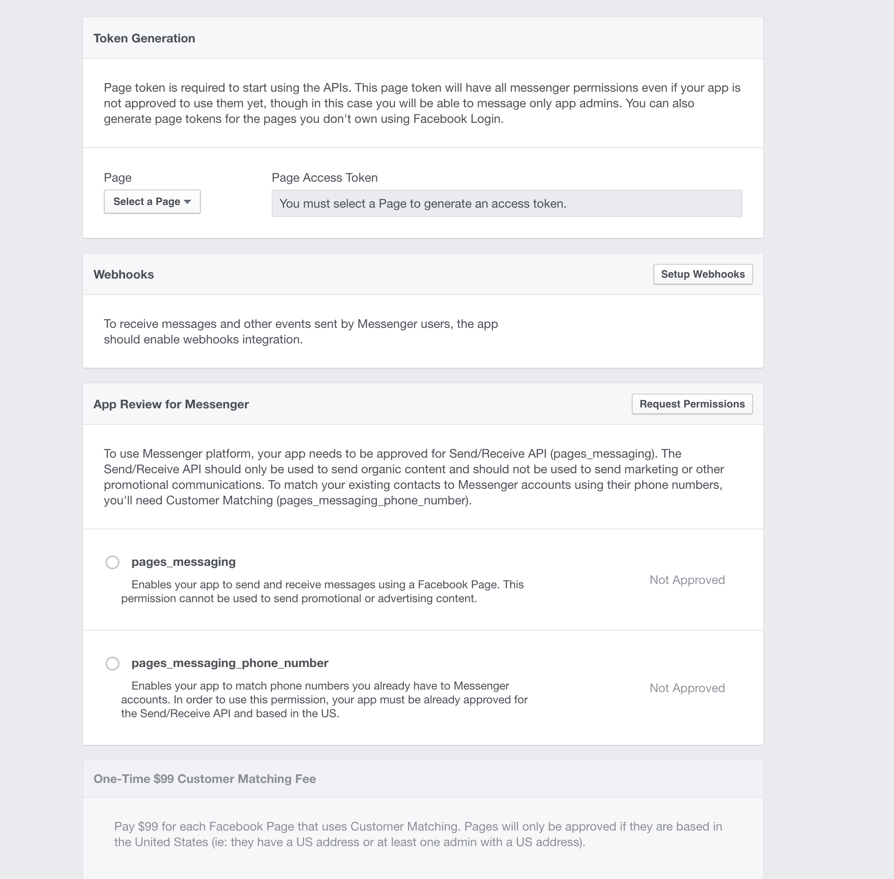
9. In the "Token Generation" section, under "Page" do the "Select Page" and find the page you created above. You may get a login message from Facebook make sure you allow access to the WeatherBot page you just created, go ahead an click 'Okay' for all of them. You own the page, it isn't published, nothing bad will come of it.
10. It should have created a unique "Page Access Token" for you to now use. This is also very important to save for later/write down/remember it/keep the browser open.
11. Lastly, for Facebook, we need a "Verify Token" so when you are communicating with the app, Facebook knows it is you and not someone else. You can have it be whatever you like, I just went to [Random.org/strings](https://www.random.org/strings) and generated a random one. Or it can be something unique to the app or you. Whatever it is, *remember it for later*
12. Okay now, let's head back to our `index.js` file and add some code in.
13. Below your require statments, let's setup our Facebook details:

    var FB_PAGE_ID      = "<INSERT PAGE_ID>";
    var FB_PAGE_TOKEN   = process.env.FB_PAGE_TOKEN || "<INSERT PAGE TOKEN>";
    var FB_VERIFY_TOKEN = process.env.FB_VERIFY_TOKEN || "<INSERT VERIFY TOKEN>";
    if (!FB_PAGE_TOKEN) {
        	console.log('Error: Specify page_token in environment');
        	process.exit(1);
    }
    if (!FB_VERIFY_TOKEN) {
        	console.log('Error: Specify verify_token in environment');
        	process.exit(1);
    }
    

1. 
Now **please note, if you are distrubuting this software you would not want these tokens to be in your code. You would save them in your environment variables on your server, but for now we are just going to hard code them in**

2. 
Anyways, moving on as this is only a demo. With these tokens in there, let's add the code to setup our bot.

    var controller = Botkit.facebookbot({
        	access_token: FB_PAGE_TOKEN,
        	verify_token: FB_VERIFY_TOKEN
    });
    

Your code show now totally look like this:

    var request   = require('request');
    var Botkit    = require('botkit');
    var os        = require('os');
    var _         = require('underscore');
    
    // const FB_PAGE_ID = process.env.FB_PAGE_ID && Number(process.env.FB_PAGE_ID);
    var FB_PAGE_ID      = "<INSERT PAGE_ID>";
    var FB_PAGE_TOKEN   = process.env.FB_PAGE_TOKEN || "<INSERT PAGE TOKEN>";
    var FB_VERIFY_TOKEN = process.env.FB_VERIFY_TOKEN || "<INSERT VERIFY TOKEN>";
    if (!FB_PAGE_TOKEN) {
       console.log('Error: Specify page_token in environment');
    	process.exit(1);
    }
    if (!FB_VERIFY_TOKEN) {
    	console.log('Error: Specify verify_token in environment');
       	process.exit(1);
    }
    
    var controller = Botkit.facebookbot({
        access_token: FB_PAGE_TOKEN,
        verify_token: FB_VERIFY_TOKEN
    });
    

3. 
Next up, let's create ("spawn") the bot with `var bot = controller.spawn({});`

4. 
And setup our webserver with:

    controller.setupWebserver(process.env.port || 8445, function(err, webserver) {
    	controller.createWebhookEndpoints(webserver, bot, function() {
       		console.log('ONLINE!');
    	});
    });
    

Note, both of these functions come **prebuilt with the Botkit framework! Woo!**

5. 
Lastly, we are going to add some code in so the bot can respond whenever we talk to it. Something simple!

    // reply to any incoming message
    controller.on('message_received', function(bot, message) {
    	bot.reply(message, 'I heard... something!');
    });
    

What this code does is just repond with "I heard...something" anytime the bot gets a message/a user sends  amessage.

6. 
Alright, so our code is setup, the next question is how do we get Facebook to see it? Welcome **ngrok**. Ngrok is a secure tunnel to localhost, i.e. you don't actually have to have a server setup right now to deploy too! Makes testing and debugging **much, much easier**

7. 
Head over to the [Ngrok website](https://ngrok.com/) and click Download to download the one for your computer.

8. 
Back in your terminal, make sure you are still in the directory of your project, unzip nrok with `unzip ~/Downloads/ngrok-stable-darwin-amd64.zip` Hopefully it will have unzip ngrok into your weatherbot directory

9. 
With ngrok unzipped, go ahead and run `./ngrok http 8445`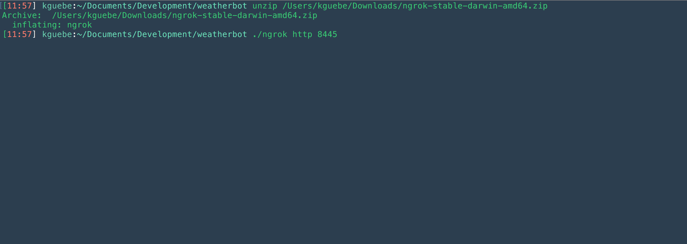

10. 
ngrok will now start up the local tunnel - it should look something like this: 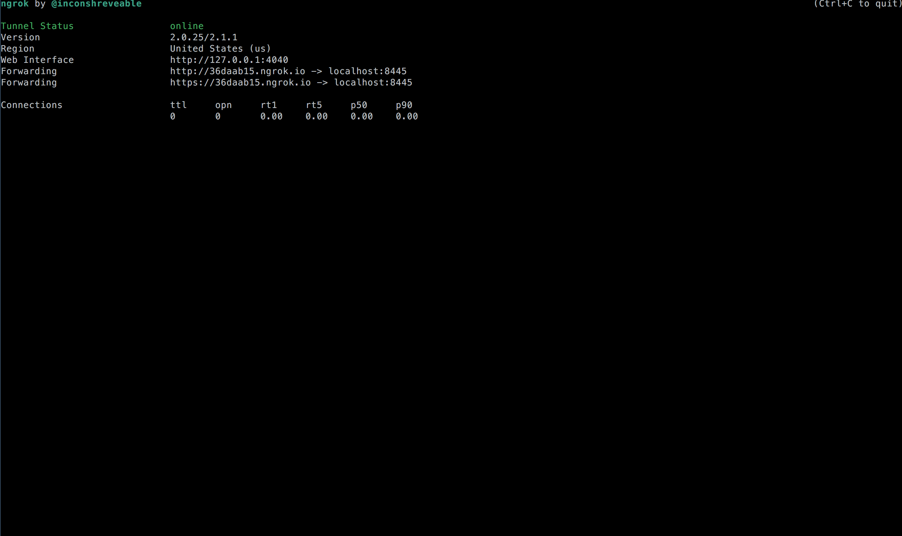

11. 
You will see there is a new unique url in the terminal window now next to Forwarding. This is your ngrok url that you can now access on any webpage as long as ngrok is running. One is secured (SSL/https) and the other is not. We will need the secure one for Facebook. **Note, mine is different than yours! Don't just type in what you see!**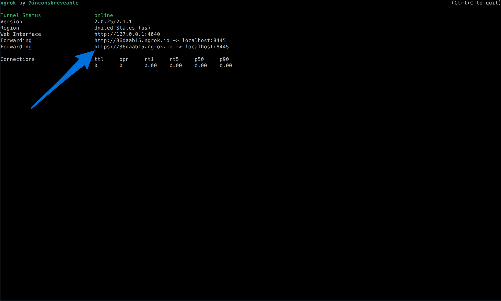

12. 
Go ahead an open up a new tab in your terminal (or new terminal however you like), `cd` into the bot director and run `node index.js`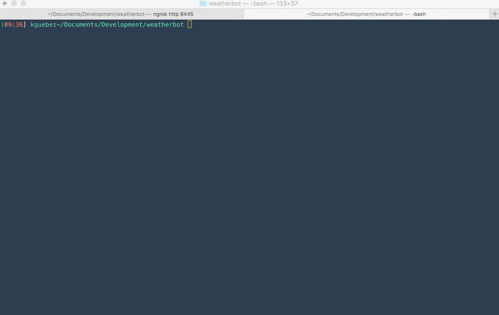

13. 
If all goes well, you should see `info` statements bring printed to the terminal. Congratulations, it is running! We are so close to getting it set up.

14. 
Go back to your ngrok tab/terminal and copy that `https` url.

15. 
Open a new browser window (or go back to your other ones), and head back to your Facebook app you created in the developer site.

16. 
On the left hand side, click on "Messenger" then on "Setup Webhooks" 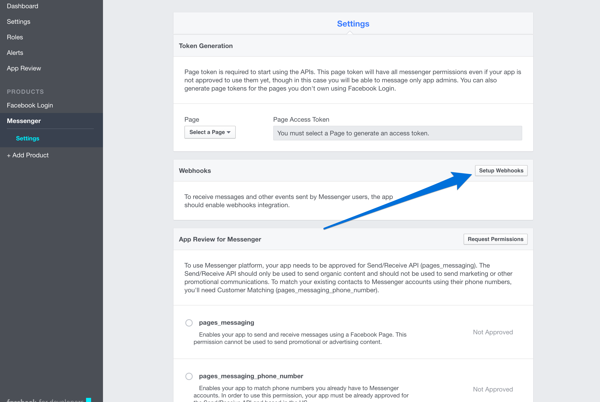

17. 
Where is says "Callback URL", paste in your ngrok https url.

18. 
For Verify Token, remember that token we created at **step 11**, go ahead and paste it in there too.

19. 
Lastly, check all the boxes for Subscription Fields. 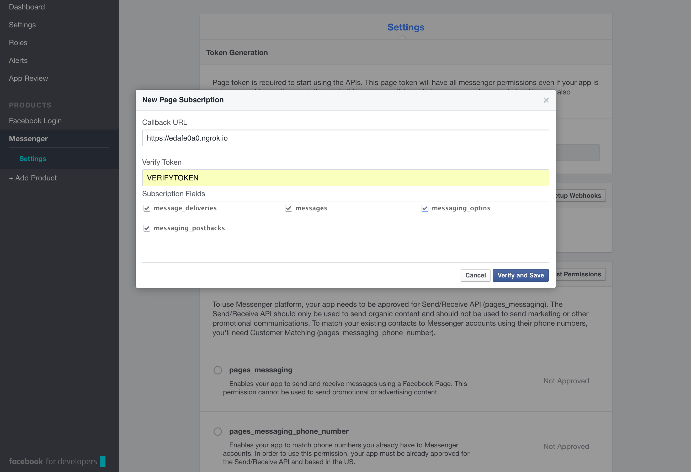

20. 
If you hit "Verify and Save" now, you will get an error for the Callback URL. Hover over the red triangle and it will have a 404 error. That is because Facebook is looking for a specific callback url to hit and get the information we need.

21. 
Go back to your callback url and add at the end `facebook/receive` to the end of it. So it should look something like: `https://edafe0a0.ngrok.io/facebook/receive`

-Note, make sure that ngrok is running and you have your app running with `node index.js`

22. 
Now, go ahead and hit "Verify and Save" to get it to work. You will notice on the left hand side Facebook added the section 'Webhooks' under Products. If you ever need to change the url or verify token, this is where you would do it. Example use case would be when you stop and restart ngrok.

23. 
If all has gone according to plan, we are very close! Just a quick recap to make sure we've checked everything off of the list: 1. Setup Facebook Page & App 2. Have our bot running with `node index.js` and have ngrok running 3. Placed our Callback URLs (ngrok), Verify Tokens, and App Id's in the correct spots

#### Interacting with WeatherBot

Hopefully at this point you have done the steps above. Let's start interacting with our bot.

1. 
Head over to your Facebook Page that you created for Weatherbot. At the bottom of the banner image you should see a button that says "Message" (right next to Like). Click that button and a chat window should open up with Weatherbot. If it doesn't, click on the Message button again for the dropdown, and click "Copy Messenger Link". Then go to Messenger, start a new conversation, and paste that link in at the top.

2. 
Let's see if it works - go ahead and send the message **Hello** to WeatherBot. Hopefully WeatherBot responded with "I heard...something!" 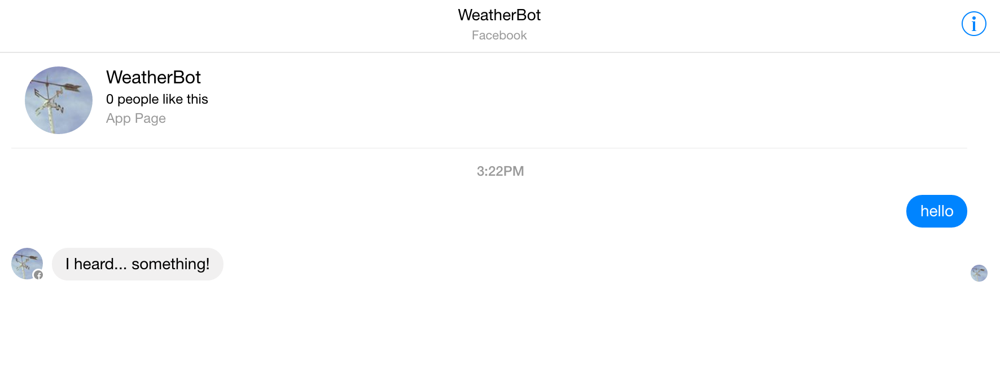

3. 
Congratulations! You have your first bot set up!

4. 
You may be thinking now "Well that's kind of cool...but it only does one thing." Yes I know, but we have to start somewhere!

### Working with LUIS

LUIS is a beast within itself, so be patient and let's get started. If you're curious about more information and the LUIS Help documentation, [check it out here](https://www.luis.ai/Help)

1. First off, go to [the LUIS Website](https://www.luis.ai) and sign in with your Microsoft Account.
2. You'll be directed to a sceren that says "My Applications" at the top. Click on "+New App" and then on "New Application" 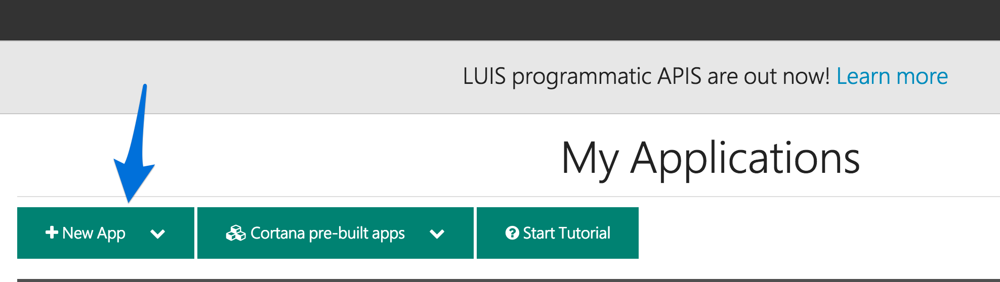
3. Let's fill out this information with our basic information for the WeatherBot and then click "Add App" at the bottom 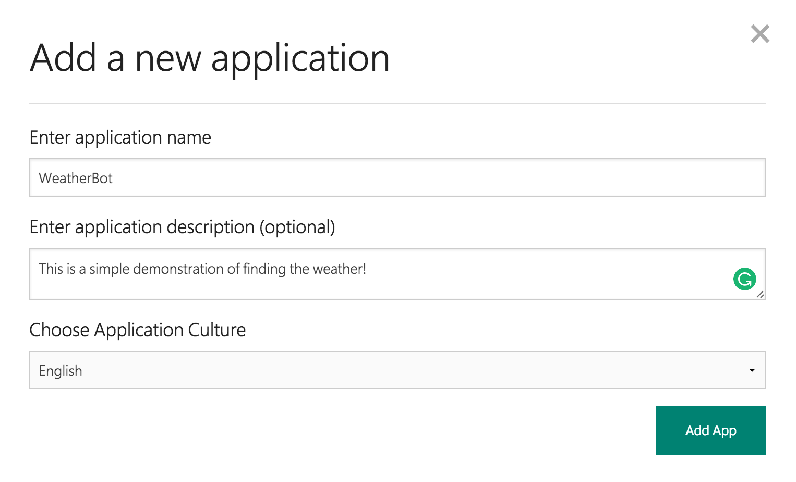
4. It may take a couple seconds for Microsoft to process your request, so be a bit patient, but once it does, you should be taken to a screen that looks like this: 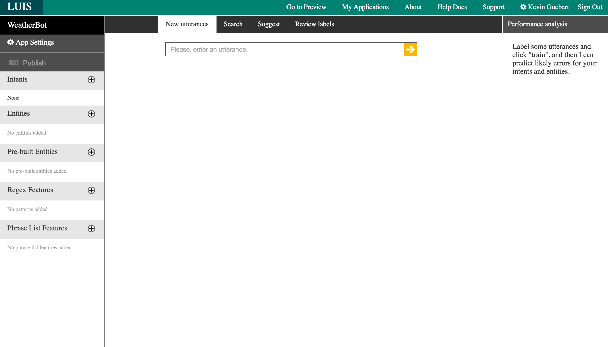

Now would be a good time to do a quick timeout to understand some basic terminology.

#### Terminology Timeout

**Intents**: An intent is something that the user/bot is trying to do. This could be `FindWeather` for us, or if you are searching for movies it could be `FindMovie`. It could also be things like `FindNews` or `ShareNews`. I often associate them with verbs and actions the user it trying to do.

**Entities**: Entities are often what make up an intent. For example, `Find X-Men` would have an Intent of `FindMovie` and "X-Men" would be an Entity of `Movie`. Or if you are doing news and have "find news about mars", the intent would be `FindNews` and the word "mars" would be an entity of type `Topic` because you are trying to find the news about mars.

**Utterances**: Phrases that a user may say

//end timeout

#### Setting Up Intents and Entities

For our WeatherBot, we are going to keep it simple. Because of that, we are going to be setting up a two or three intents and entities in LUIS. Let's get started.

1. Let's add a new Entity. On the left hand side, hit the plus button next to "Pre-Built Entities", and in the dialog box click on "Geography" 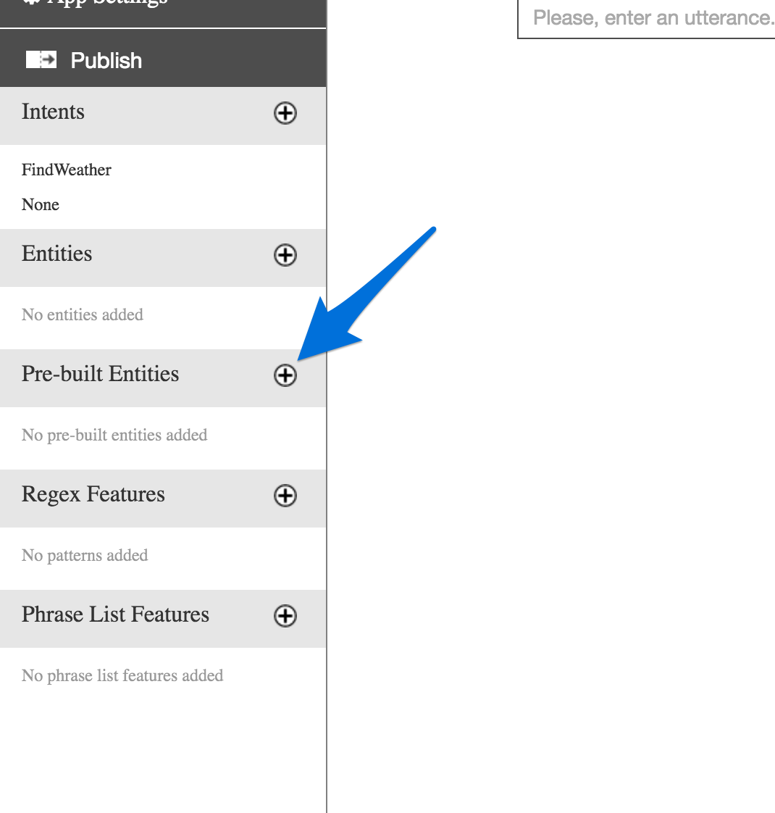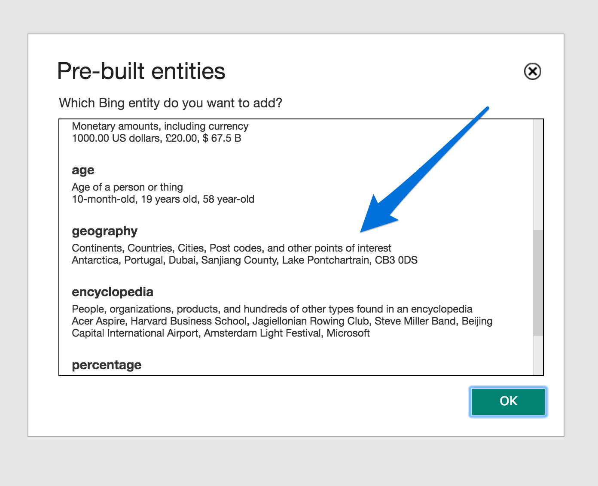
2. Next up, let's create an new Intent. Hit the plus button next to Intents, called it "FindWeather" and we are going to type in an utterance. Let's do something simple: "weather in Atlanta". 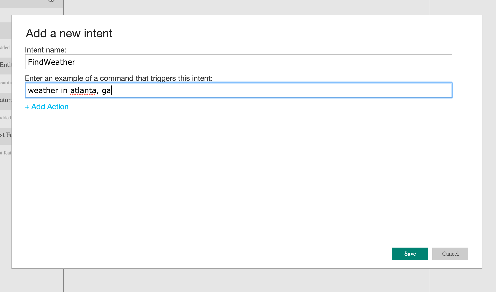
3. Go ahead and hit save and you should get something like this (note **do not** click submit): 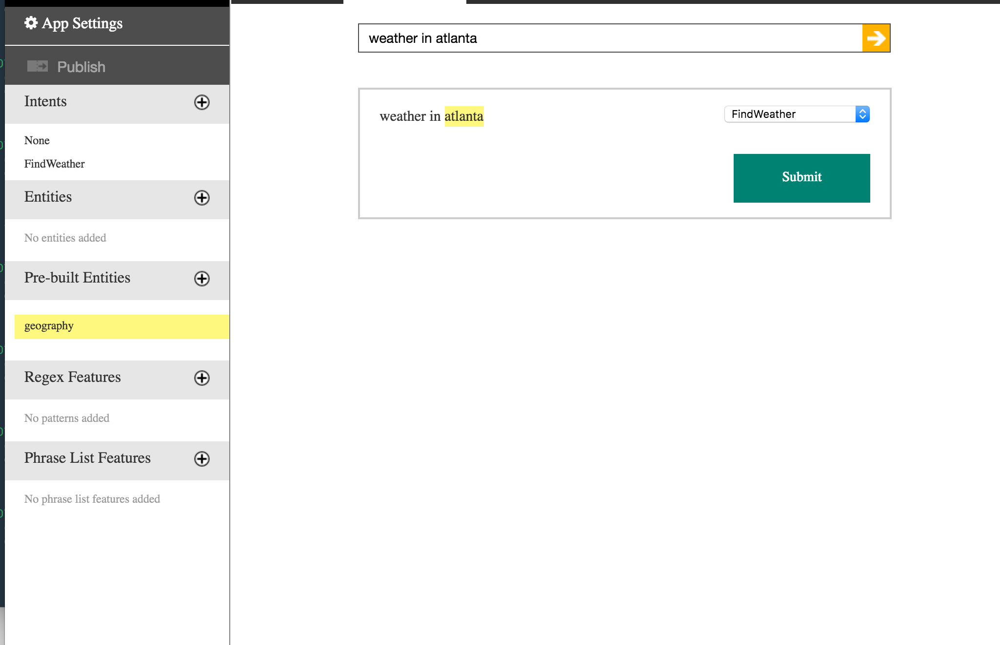
4. Right now, we have the word 'Atlanta' highlighted and hopefully LUIS has recognized this as a datetime and geography entity!
5. Now that we have one down, let's go ahead and add a couple more phrases that could be classified under the 'FindWeather' intent.

-weather in new york?

-weather in san francisco?

-forecast for Miami
6. Make sure for each utterance you put in, you classify it as "FindWeather" in the dropdown to the right.
7. Next up, in the bottom left hand corner is a button that says "Train". Go ahead and click that to train our LUIS application.
8. With our LUIS model trained, on the left hand side there is a "Publish" button, let's click on that and then click on 'Publish Web Service"
9. We now have a published application. Let's try out our application by typing out a similar phrase to our FindWeather intent in the "Query" field. Type out "weather in miami" and the click on the URL right below it. It'll give you a JSON output with the top scoring intent and what LUIS understood it as.
10. It will open up in a new window with the query sent to the LUIS WeatherBot application and have a JSON representation of what it understood. If all went well, you should see the "FindWeather" Intent with a larger score, and our entity - builtin.geography.city. The score represents which intent LUIS matched with most. A score close to 1 means it matched it very well, closer to 0 means not so much. INSERT IMAGE
11. For now, that is going to be the only intent we are going to set up for our bot. We can maybe try more later, but let's get back to the code.

### Integrating LUIS and the Code

Let's head back to our code editor, open up the folder, and get started with integration. Go ahead and open `index.js`

1. 
To integrate LUIS, let's create a new function that handles all requests. We are going to call it `requestLUIS` and it is going to take our `bot` and the `message` as arguments

    function requestLUIS(bot, message) {
    });
    

2. 
Earlier we created the `controller.on('message_received'...` in our code. What this statement did was listen to anytime a message received and then just reply with "I heard... something". So let's change that up so anytime we get a message, we request it to LUIS.

    controller.on('message_received', function(bot, message) {
    	requestLUIS(bot, message);
    });
    

3. 
Now we need to send the message to LUIS to try and understand it. Luckily, that url we clicked under "Query" in LUIS is just what we need. So let's go back to LUIS.

4. 
When you go back to your LUIS app, you will see at the top a button for "Go to Preview", click on that INSERT IMAGE

5. 
Then, on the left hand side, click "Publish" again, then again "Update Published Application". Copy that URL. The only difference between the Preview and Production URL is that the Preview URL predicts and returns only what you need instead of us, as developers, trying to figure out what intent it found. If you want to see the change, do the same Query step from above. INSERT IMAGE

6. 
Near the top of our code, where we definded our FB_PAGE_ID and FB_PAGE_TOKEN, let's go ahead and create a variable for our LUIS Url:

    var LUIS_API_URL = "INSERT_URL_HERE";
    var FB_PAGE_ID ...
    

7. 
Now head back to the `requestLUIS` function and get started with making a request"

    function requestLUIS(bot, message) {
    	request(LUIS_API_URL + "&q=" + message.text, function(error, response, body) {
    		if(!error && response.statusCode == 200) {
    			var data = JSON.parse(body);
    			console.log(data);
    		} else {
    			console.log("Error in LUIS Request: " + error);
    		}
    	});
    }
    

8. 
Now go back to your terminal, go to the one that has `node index.js` running (**not ngrok**), hit Ctrl-C to stop the process, then again type in `node index.js` to start it back up.

9. 
Hopefully, if all went well, we can head back over to Messenger and send another message to WeatherBot. Let's do one of the ones we know: "will it rain tomorrow" (note, if it seems slow to respond or you are not getting anything in your console, try restarting it again)

10. 
In our console you should see the response returned from LUIS:  INSERT IMAGE

11. 
Alright, so we successfully got data back from LUIS, let's manipulate the data now.

    ...
    var data = JSON.parse(body);
    var intent = data.topScoringIntent.intent;
    switch(intent) {
    	case "FindWeather":
    		findWeather(bot, message, data);
    		break;
    	case "None":
    		bot.reply(message, "Oops, didn't quite understand you :(");
    		break;
    }
    ...
    

What did we just do? Well we took the JSON data that was returned from LUIS, figured out what the topScoringIntent was (the one that matched closest with the user's message), then created a `switch` statement on the intent. You may notice I called a new function `findWeather(bot, message, data)` that we haven't created yet. We will do that next. The whole `requestLUIS` function should look like this:

    function requestLUIS(bot, message) {
    	request(LUIS_API_URL + "&q=" + message.text, function(error, response, body) {
    		if(!error && response.statusCode == 200) {
    			var data = JSON.parse(body);
    			var intent = data.topScoringIntent.intent;
    			switch(intent) {
    				case "FindWeather":
    					findWeather(bot, message, data);
    					break;
    				case "None":
    					bot.reply(message, "Oops, didn't quite understand you :(");
    					break;
    			}
    		} else {
    			console.log("Error in LUIS Request: " + error);
    		}
    	});
    }
    

12. 
Let's create our `findWeather` function now:

    function findWeather(bot, message, data) {
    	 var entities = data.entities; //from our JSON reponse
        var location = _.findWhere(entities, { type: 'builtin.geography.city' });
        if(!location) {
            console.log("No weather type found");
            bot.reply(message, "Uhoh, I didn't quite get that");
        } else {
            var locationIndex = _.indexOf(entities, location);
            var dateTime = _.findWhere(entities, { type: 'builtin.datetime.date' });
            var state = _.findWhere(entities, { type: 'builtin.geography.us_state'});
            if(dateTime) {
                bot.reply(message, "Okay, I'm going to check the weather in " + location.entity + " for " + dateTime);
            } else {
                bot.reply(message, "Okay, I'm going to check the wather in " + location.entity); 
            }
            requestWeather(bot, message, location, dateTime, state);
        }
    }
    

*Important Note* Alright, let's back up a smidge. If you look at the LUIS documentation, you will see that there is not **just one** type of datetime. There is a datetime.date, datetime.time, and more. So if we put in "will it rain tomorrow" - tomorrow is a datetime.date. If we put in "will it rain at 6:00" - 6:00 is a datetime.time. So if you build this out more, that is something you will need to think about! So above we are just getting the datetime entity based off of that it is not the weathertype entity, thus the other entity in the entities array will be the datetime one. Confusing, I know. This is also the same for builtin.geography. However, it only works for the US...limitations.

Also, I created another new function `requestWeather` which will be get our weather data.

13. 
Let's create `requestWeather`. However, to get weather data we are actually going to install another npm module. So go back to your terminal, you can Ctrl-C the `node index.js` process, and then type `npm install weather-js`. *Note, I have no relation with this module and cannot garuantee it will work when you try it out. It is just for tutorial purposes. You can [view the code here](https://github.com/fatihcode/weather)

14. 
With it now installed, go back to our code to add it to the `require` statements:

    ...
    var _         = require('underscore');
    var weather   = require('weather-js');
    

    function requestWeather(bot, message, location, dateTime, state) {
        var loc = location.entity;
        if(state) {
            loc = loc + ", " + state.entity;
        }
        weather.find({search: loc, degreeType: 'F'}, function(err, result) {
            if(err) {
                console.log(err);
            } else {
                var currentWeather = result[0].current;
    
                var temperature = currentWeather.temperature;
                var weatherText = currentWeather.skytext;
                var day         = currentWeather.day;
                var image       = currentWeather.imageUrl;
    
                var temp = {};
                    temp.title = weatherText;
                    temp.image_url = image;
                    temp.subtitle = day + ": " + temperature;
    
                var weatherArray = [];
                    weatherArray.push(temp);
                    console.log(temp);
                var msg = fbMessageTemplate("generic", "elements", null, weatherArray)
                bot.reply(message, msg);
            }
        });
    }
    

Let's look at the code above. First off, if the state exists in the query i.e. if a user types in "weather in Atlanta, GA", we want to add it onto the location search. We then use the weather-js library we juts downloaded to get data back. We get the first result from the returned data (this could be improved later but works for now), then we capture the temperature, text, day, and image from the returned data.

The next part is where more Facebook work comes in. We are going to take another timeout

#### Facebook Structure Data Timeout

With the release of the Messenger platform, Facebook also allowed developers to use a "Strucured Data Template". You can see examples of what they look like below, but it allows develoeprs to add buttons, text, receipts, links, and images to the responses to users. [You can view them all here](https://developers.facebook.com/docs/messenger-platform/implementation)

There are three main types:

1. Button Template 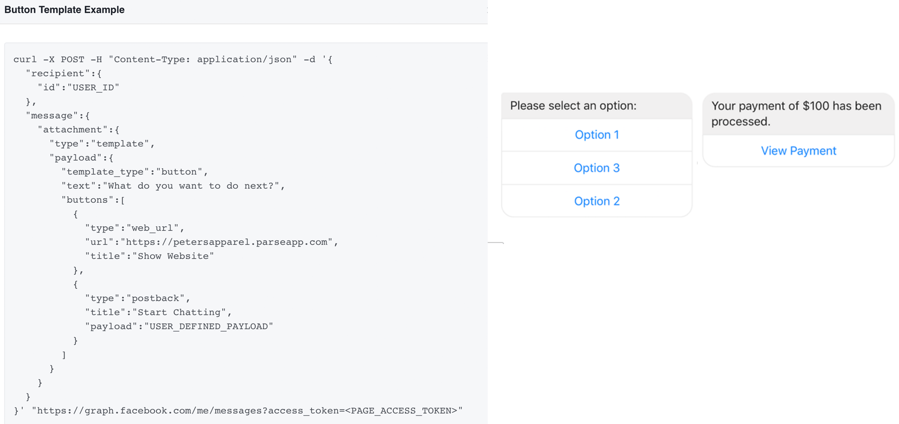
2. Generic Template 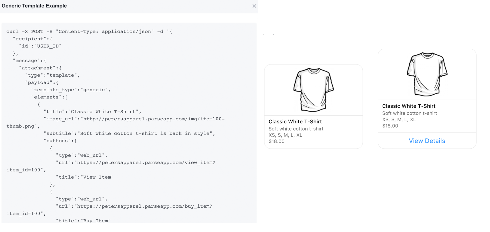
3. Receipt Template 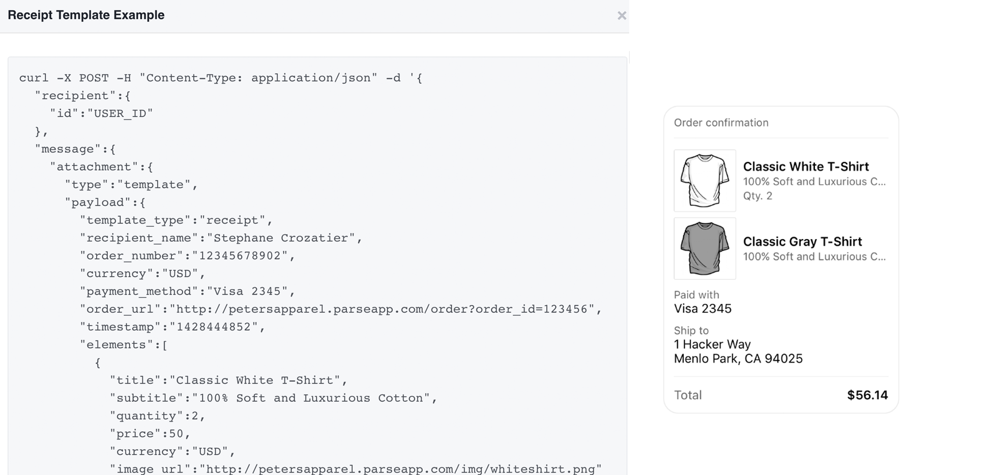\	

//end timeout

15. 
Back to the code, you will see that I created a `temp` object to hold the data, we are going to create a Generic template to send back which will contain a) the image b) the text of the weather c) a subtitle of the day and the temperature. It'll look something like this: INSERT IMAGE

16. 
I created a helper function called `fbMessageTemplate` which takes in 4 arguments (could be condensed but that's okay). The 4 arguments are the template type (generic, button, or receipt), the element type (elements or buttons), a title (for the buttons template), and then the data. **Note**, the data passed through has to be **an array** that conforms to the template type structure you are passing through. If you have a Button Template, the data array needs to have all the requirements to be a button (url, title, etc.). To view the full documentation on this, [go to the Facebook Developer's Website](https://developers.facebook.com/docs/messenger-platform/implementation)

17. 
Here is the code for the `fbMessageTemplate` function

    function fbMessageTemplate(template, elementType, text, data) {
        var messageData = {
            "attachment": {
                "type": "template",
                "payload": {
                    "template_type": template,
                }
            }
        };
        if(elementType == "buttons"){
            messageData.attachment.payload.buttons = data;
            messageData.attachment.payload.text = text;
        } else {
            messageData.attachment.payload.elements = data;
        }
        return messageData;
    }
    

18. 
Alright, so if we combine it all together, this is what your whole `index.js` file should look like:

    var request   = require('request');
    var Botkit    = require('botkit');
    var os        = require('os');
    var _         = require('underscore');
    var weather   = require('weather-js');
    
    
    var LUIS_API_URL    = "<LUIS_API_URL>";
    var FB_PAGE_ID      = "<FB_PAGE_ID>";
    var FB_PAGE_TOKEN   = process.env.FB_PAGE_TOKEN || "<FB_PAGE_TOKEN>";
    var FB_VERIFY_TOKEN = process.env.FB_VERIFY_TOKEN || "<FB_VERIFY_TOKEN>";
    if (!FB_PAGE_TOKEN) {
        console.log('Error: Specify page_token in environment');
        process.exit(1);
    }
    if (!FB_VERIFY_TOKEN) {
        console.log('Error: Specify verify_token in environment');
        process.exit(1);
    }
    
    var controller = Botkit.facebookbot({
        access_token: FB_PAGE_TOKEN,
        verify_token: FB_VERIFY_TOKEN
    });
    
    var bot = controller.spawn({});
    
    controller.setupWebserver(process.env.port || 8445, function(err, webserver) {
        controller.createWebhookEndpoints(webserver, bot, function() {
            console.log('ONLINE!');
        });
    });
    
    // reply to any incoming message
    controller.on('message_received', function(bot, message) {
        requestLUIS(bot, message);
    });
    
    function requestLUIS(bot, message) {
        request(LUIS_API_URL + "&q=" + message.text, function(error, response, body) {
            if(!error && response.statusCode == 200) {
                var data = JSON.parse(body);
                var intent = data.topScoringIntent.intent;
                switch(intent) {
                    case "FindWeather":
                        findWeather(bot, message, data);
                        break;
                    case "None":
                        bot.reply(message, "Oops, didn't quite understand you :(");
                        break;
                }
            } else {
                console.log("Error in LUIS Request: " + error);
            }
        });
    }
    function findWeather(bot, message, data) {
        var entities = data.entities; //from our JSON reponse
        var location = _.findWhere(entities, { type: 'builtin.geography.city' });
        if(!location) {
            console.log("No weather type found");
            bot.reply(message, "Uhoh, I didn't quite get that");
        } else {
            var locationIndex = _.indexOf(entities, location);
            var dateTime = _.findWhere(entities, { type: 'builtin.datetime.date' });
            var state = _.findWhere(entities, { type: 'builtin.geography.us_state'});
            if(dateTime) {
                bot.reply(message, "Okay, I'm going to check the weather in " + location.entity + " for " + dateTime);
            } else {
                bot.reply(message, "Okay, I'm going to check the wather in " + location.entity); 
            }
            requestWeather(bot, message, location, dateTime, state);
        }
    }
    
    function requestWeather(bot, message, location, dateTime, state) {
        var loc = location.entity;
        if(state) {
            loc = loc + ", " + state.entity;
        }
        weather.find({search: loc, degreeType: 'F'}, function(err, result) {
            if(err) {
                console.log(err);
            } else {
                var currentWeather = result[0].current;
    
                var temperature = currentWeather.temperature;
                var weatherText = currentWeather.skytext;
                var day         = currentWeather.day;
                var image       = currentWeather.imageUrl;
    
                var temp = {};
                    temp.title = weatherText;
                    temp.image_url = image;
                    temp.subtitle = day + ": " + temperature;
    
                var weatherArray = [];
                    weatherArray.push(temp);
                    console.log(temp);
                var msg = fbMessageTemplate("generic", "elements", null, weatherArray)
                bot.reply(message, msg);
            }
        });
    }
    
    function fbMessageTemplate(template, elementType, text, data) {
        var messageData = {
            "attachment": {
                "type": "template",
                "payload": {
                    "template_type": template,
                }
            }
        };
        if(elementType == "buttons"){
            messageData.attachment.payload.buttons = data;
            messageData.attachment.payload.text = text;
        } else {
            messageData.attachment.payload.elements = data;
        }
        return messageData;
    }
    

19. 
Alrighty, so we have `index.js` all set up, let's head back to the terminal, Ctrl-C if you already have `node index.js` running, then go ahead and run it again with `node index.js`

20. 
Now we can head back to our WeatherBot Facebook message and type out on of our commands. Let's try "weather in Atlanta, GA"  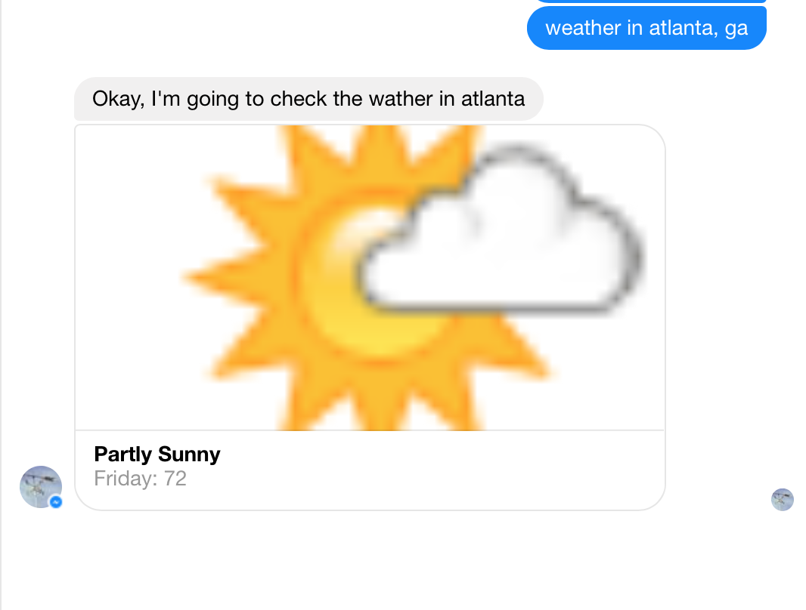

21. 
Congratulations! Hopefully you got back something like I did! Your first bot is a success :) Go ahead and try out some other cities, "weather in seattle" or "weather in New york". Every once in a while you may get one of our default responsese "Opps, didn't quite understand you." If your text was correct, maybe LUIS just doesn't understand it yet. All it takes is you going back to LUIS, typing in the utterance, and then training it. It should catch on pretty quickly.

## Where to go from here

So what did we create? We created a simple chat bot interface that gives you the weather in a city. Exciting work but you can go so much further than this.

#### Challenges to try

-What if we don't know the location? Can the user send their location through Facebook's Messenger location feature? Absolutely they can, and there are ways to do that with Botkit.

-How about a forecast? The npm library we used (weather-js) gives you the next couple days weather. If the user types in "weather in atlanta, ga tomorrow", LUIS can understand that "tomorrow" is a datetime and can give you that back. Then you just have to parse it and get the correct data.

-How about specifc type of weather? "Will it rain tomorrow" would be a great challenge. You would need to find the user's location, then create an entity to recognize the word "rain" or "thunderstorm" or "sunny", then you need to use the word "tomorrow" to get the weather for tomorrow.

-How about storage? Botkit provides a simple way to do storage by json-file saving. What if a users asks "will it rain tomorrow", you prompt them for their location, save it, then next time they ask "will it be sunny tomorrow" you already know where they are!

There are so many paths that you can take with this, I hope I was able to provide a foundation for it all. Next steps for this bot, if it were more fleshed out, would be to then deploy it to a server (ngrok only runs when your computer is open), and then get it reviewed by Facebook to publish. I have not done either of those so I am unable to help there! (Note, Facebook requires a https/secure server. So thus you will need some keys and certs, look into it!)

If you have any questions, problems, or improvements, please let me know!

[Checkout the code on Github to learn more](https://github.com/kevinguebert/Bot-Tutorial)

---

Note, most images are screenshots. Images from Facebook are images of Facebook and owned by Facebook. Images of LUIS are images of LUIS and owned by Microsoft. I do not own or have any relation with the services. I am also not liable for anything if somehow something gets messed up. This is purely for fun and a tutorial - I am happy to help out when need be and when I can.
