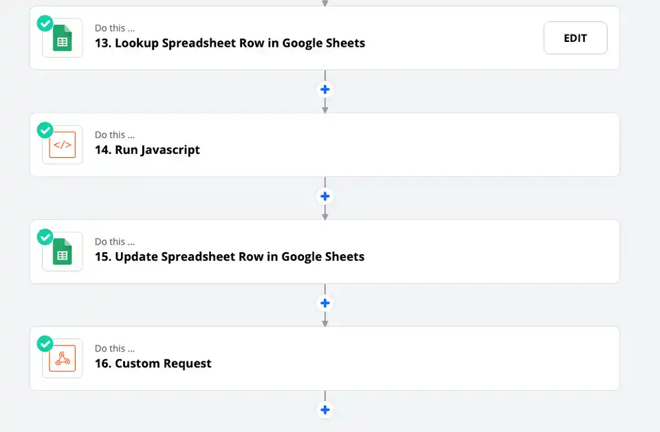
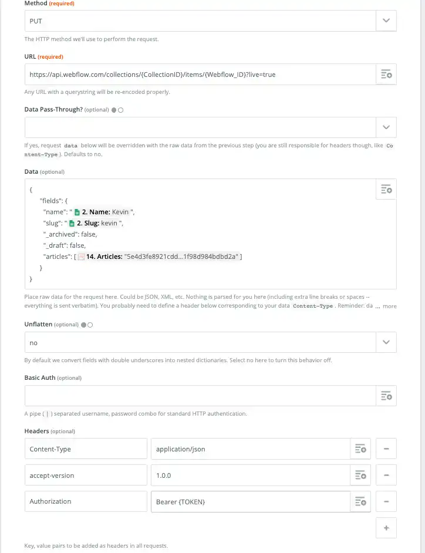

This past week while integrating Zapier and Webflow, I became surprised to learn that updating reference and multi-reference fields did not work right out of the box. After spending more time than I wanted on it, I was able to make it work for both single reference and multi-reference. This post is only about multi-reference as single-reference is actually "easier."

### Overview



To do this in totality will take 4 steps. I use Google Sheets as my intermediary of choice but you can use Airtable or any other spreadsheet software.

#### Step 1

In my "Lookup Spreadsheet Row in Google Sheets", I am looking up the corresponding row to see if there are already referenced items. For a User that has multiple Posts, I would be looking up the User and return the column for Posts reference.

That column will either be empty or be a string of referenced IDs like "1234", "ABCD", "34543"

#### Step 2

Here I run some Javascript to clean up what I am looking for. I have the new Post ID coming in and a list of current IDs already attached to the user.

```
let result = []
if (inputData.articles != null && inputData.articles.length > 0) {
  result = inputData.articles.split(",");
}
result.push('"' + inputData.newArticle + '"');
result = result.join(", ");

output = [{articles: result}];
```

The code goes through the Post column. If there is currently data there (already has posts), it splits the string into an array from "1234", "ABCD", "34543" into  ["1234", "ABCD", "34543"].

Then, with the new Post ID, I push that onto the end of the array so it then becomes ["1234", "ABCD", "34543", "NEW_POST_ID"].

Lastly, because I can't have an array and actually need a string, I concatenate it all together into "1234", "ABCD", "34543", "NEW_POST_ID".

#### Step 3

Now I go back and update the same Google Spreadsheet with the updated posts reference. This is for next time and Post is added, it will be the correct references.

#### Step 4

Lastly, a PUT request to the Webflow API. I follow the documentation <https://developers.webflow.com/#update-live-collection-item> to understand a little bit more how the request should be built and ended up with something fairly simple in Zapier.

Key Points from the Screenshot below:

1. Make sure to update the {CollectionID} with your collection.
2. The {Webflow_ID} is the ID of the Webflow item you are trying to update. In this scenario, it would be the User
3. The fields "name", "slug", "_archived", and "_draft" are all required in the request.
4. For the "articles" field (this is the Posts), we want to pass in the Javascript output from the previous step into an array. So that is literally `[{Result from previous step}]` with the "\[ ]" around the output. This is the format that Webflow accepts in their API
5. Don't forget the Headers at the bottom along with your authorization token which you can find at https://webflow.com/dashboard/sites/{website}/integrations



